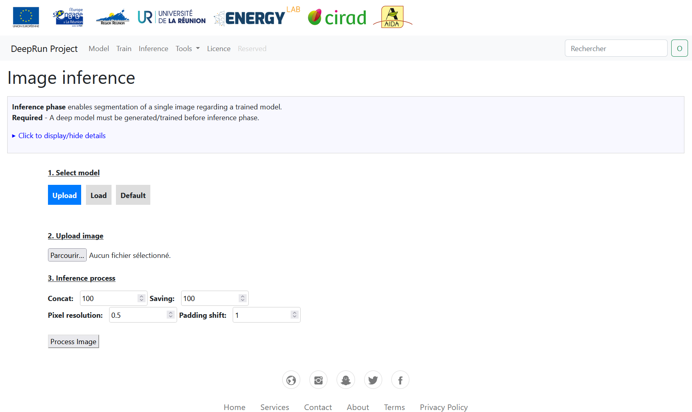

<!-- Improved compatibility of back to top link: See: https://github.com/othneildrew/Best-README-Template/pull/73 -->
<a name="DeepRun application"></a>
<!--
*** Thanks for checking out the Best-README-Template. If you have a suggestion
*** that would make this better, please fork the repo and create a pull request
*** or simply open an issue with the tag "enhancement".
*** Don't forget to give the project a star!
*** Thanks again! Now go create something AMAZING! :D
-->


<!-- PROJECT SHIELDS -->
<!--
*** I'm using markdown "reference style" links for readability.
*** Reference links are enclosed in brackets [ ] instead of parentheses ( ).
*** See the bottom of this document for the declaration of the reference variables
*** for contributors-url, forks-url, etc. This is an optional, concise syntax you may use.
*** https://www.markdownguide.org/basic-syntax/#reference-style-links
-->

<!-- PROJECT LOGO -->
<br />
<div align="center">
  <a href="https://github.com/othneildrew/Best-README-Template">
    
  </a>

  <h3 align="center">Deep Learning for Reunion Energy Autonomy</h3>

  <p align="center">
    A GUI application for deep learning model generation, model training and images inference!
    <br />
    <a href="https://github.com/othneildrew/Best-README-Template"><strong>Explore the docs »</strong></a>
    <br />
    <br />
    <a href="https://github.com/othneildrew/Best-README-Template">View Demo</a>
    ·
    <a href="https://github.com/othneildrew/Best-README-Template/issues">Report Bug</a>
    ·
    <a href="https://github.com/othneildrew/Best-README-Template/issues">Request Feature</a>
  </p>
</div>


<!-- TABLE OF CONTENTS -->
<details>
  <summary>Table of Contents</summary>
  <ol>
    <li>
      <a href="#about-the-project">About The Project</a>
      <ul>
        <li><a href="#built-with">Built With</a></li>
      </ul>
    </li>
    <li>
      <a href="#getting-started">Getting Started</a>
      <ul>
        <li><a href="#prerequisites">Prerequisites</a></li>
        <li><a href="#installation">Installation</a></li>
      </ul>
    </li>
    <li><a href="#usage">Usage</a></li>
    <li><a href="#roadmap">Roadmap</a></li>
    <li><a href="#contributing">Contributing</a></li>
    <li><a href="#license">License</a></li>
    <li><a href="#contact">Contact</a></li>
    <li><a href="#acknowledgments">Acknowledgments</a></li>
  </ol>
</details>


<!-- ABOUT THE PROJECT -->
## About The Project

<div align="center">
  
</div>
<br>
  
The main objective of the DeepRun postdoctoral project is to develop multi-scale image recognition tools, using Deep Learning algorithms, applied to the estimation of biomass resources for bioenergy production, and to the reliability of hydrogen converters for energy storage optimization.

Here are the main features:
* Model generation: a model instance is generated from a source file or a set of fixed parameters 
* Model training: a training phase can be performed from a given dataset and generated model
* Image inference: image segmentation is done with the trained model and high-resolution imagery

The application's functionalities are designed to cover the specific needs of the project. As such, they are not exhaustive and will be updated on a regular basis.

Use the `README.md` to get started.

<p align="right">(<a href="#readme-top">back to top</a>)</p>


### Built With

List of main packages required by the application:

[](https://github.com/tensorflow/tensorflow/releases/tag/v2.10.1)

[](https://github.com/pytorch/pytorch/releases/tag/v1.10.0)

[](https://github.com/OSGeo/gdal/releases/tag/v3.4.3)

[](https://pypi.org/project/Flask/2.3.2/)


<p align="right">(<a href="#readme-top">back to top</a>)</p>


<!-- GETTING STARTED -->
## Getting Started

Here is an example of instructions for setting up your project locally. To get a local copy up and running, follow these simple steps:

### Prerequisites

This is an example of how to list things you need to use the software and how to install them.
* GDAL
  ```sh
  sudo apt-get install pythonx.x-dev
  sudo add-apt-repository ppa:ubuntugis/ppa && sudo apt-get update
  sudo apt-get update
  sudo apt-get install gdal-bin
  sudo apt-get install libgdal-dev
  export CPLUS_INCLUDE_PATH=/usr/include/gdal
  export C_INCLUDE_PATH=/usr/include/gdal
  ogrinfo --version
  pip install GDAL==<GDAL VERSION FROM OGRINFO>
  ```

* Miscellaneous
    ```sh
  pip install flask
  pip install tensorflow
  pip install scikit-learn
  pip install matplotlib
  ```

### Installation

Here is an example of how install and set up the application.

1. Clone the repo
   ```sh
   git clone https://github.com/christophe-lkc/Deep-API.git
   ```
2. Install required packages
   ```sh
   pip install -r settings/requirements.txt
   ```
3. Navigate to the project directory and start the application
   ```sh
   cd Deep-API
   flask run
   ```

<p align="right">(<a href="#readme-top">back to top</a>)</p>


<!-- USAGE EXAMPLES -->
## Usage
<br>
Click on <b>Model</b> section.
<div class="image-container">
  
</div>
Two options are available, generation of a deep model from source file or a set of parameters.
<ul>
  <li>Click on 'Browse' button and select a save model.
  <ul>
    <li style="color: grey;"><i>Status message</i>
  </ul>
  <li>Click on 'Generate model'
    <ul>
    <li style="color: grey;"><i>Model summary message</i>
  </ul>
</ul>

<br>

Click on <b>Train</b> section.
<div class="image-container">
  
</div>
<ul>
  <li>Click on 'MODEL ?' button.
  <ul>
    <li style="color: grey;"><i>Status message</i>
  </ul>
  <li>Click on 'Browse X dataset' button and select the input dataset.
  <ul>
    <li style="color: grey;"><i>Import X dataset message</i>
  </ul>
  <li>Click on 'Browse Y dataset' button and select the targer dataset.
  <ul>
    <li style="color: grey;"><i>Import Y dataset message</i>
  </ul>
  <li>Click on 'START TRAINING' button.
  <ul>
    <li style="color: grey;"><i>Training summary message</i>
  </ul>
</ul>

<br>

Click on <b>Inference</b> section.
<div class="image-container">
  
</div>
<ul>
  <li>Click on prefered model selection.
  <ul>
    <li style="color: grey;"><i>Model message</i>
  </ul>
  <li>Click on 'Browse' image button and select the input dataset.
  <ul>
    <li style="color: grey;"><i>Import image message</i>
  </ul>
  <li>Click on 'Process Image' button.
  <ul>
    <li style="color: grey;"><i>Inference summary message</i>
  </ul>
</ul>

<!--
_For more examples, please refer to the [Documentation](https://example.com)_
-->

<p align="right">(<a href="#readme-top">back to top</a>)</p>


<!-- ROADMAP -->
## Roadmap

- [x] Add default pre-trained model
- [x] Add sample data
- [ ] Add default dataset
- [ ] Add others segmentation model
- [ ] Add image bubbles tracking
- [ ] Add Changelog
- [ ] Add back to top links
- [ ] Add Additional Templates w/ Examples
- [ ] Multi-language Support
    - [ ] Chinese
    - [ ] Spanish

See the [open issues](https://github.com/christophe-lkc/Deep-API/issues) for a full list of proposed features (and known issues).

<p align="right">(<a href="#readme-top">back to top</a>)</p>


<!-- CONTRIBUTING -->
## Contributing

Contributions are what make the open source community such an amazing place to learn, inspire, and create. Any contributions you make are **greatly appreciated**.

If you have a suggestion that would make this better, please fork the repo and create a pull request. You can also simply open an issue with the tag "enhancement".
Don't forget to give the project a star! Thanks again!

1. Fork the Project
2. Create your Feature Branch (`git checkout -b feature/AmazingFeature`)
3. Commit your Changes (`git commit -m 'Add some AmazingFeature'`)
4. Push to the Branch (`git push origin feature/AmazingFeature`)
5. Open a Pull Request

<p align="right">(<a href="#readme-top">back to top</a>)</p>


<!-- LICENSE -->
## License

Distributed under the MIT License. See `LICENSE.txt` for more information.

<p align="right">(<a href="#readme-top">back to top</a>)</p>


<!-- CONTACT -->
## Contact

Christophe LIN-KWONG-CHON - [@contact](https://www.energylab.re/en/membres/) - christophe.lin-kwong-chon@univ-reunion.fr

Mathieu DELSAUT - [@contact](https://www.energylab.re/en/membres/) - mathieu.delsault@univ-reunion.fr

Project Link: [DeepRun](https://www.energylab.re/en/projets/projets-en-cours/deeprun/)

<p align="right">(<a href="#readme-top">back to top</a>)</p>


<!-- ACKNOWLEDGMENTS -->
## Acknowledgments

This work, registered as the “DeepRun” project, was supported partly by the European Union through the
European Regional Development Fund (under Grant 2014FR16RFOP007), by the Reunion Island Region (under Grant GURDTI/20210802-0030854) and by University of Reunion Island.


* [European Regional Development Fund](https://ec.europa.eu/regional_policy/funding/erdf_en)
* [Reunion Island Region](https://regionreunion.com/)
* [University of Reunion Island](https://www.univ-reunion.fr/)

<p align="right">(<a href="#readme-top">back to top</a>)</p>


<!-- MARKDOWN LINKS & IMAGES -->
<!-- https://www.markdownguide.org/basic-syntax/#reference-style-links -->
[contributors-shield]: https://img.shields.io/github/contributors/othneildrew/Best-README-Template.svg?style=for-the-badge
[contributors-url]: https://github.com/othneildrew/Best-README-Template/graphs/contributors
[forks-shield]: https://img.shields.io/github/forks/othneildrew/Best-README-Template.svg?style=for-the-badge
[forks-url]: https://github.com/othneildrew/Best-README-Template/network/members
[stars-shield]: https://img.shields.io/github/stars/othneildrew/Best-README-Template.svg?style=for-the-badge
[stars-url]: https://github.com/othneildrew/Best-README-Template/stargazers
[issues-shield]: https://img.shields.io/github/issues/othneildrew/Best-README-Template.svg?style=for-the-badge
[issues-url]: https://github.com/othneildrew/Best-README-Template/issues
[license-shield]: https://img.shields.io/github/license/othneildrew/Best-README-Template.svg?style=for-the-badge
[license-url]: https://github.com/othneildrew/Best-README-Template/blob/master/LICENSE.txt
[linkedin-shield]: https://img.shields.io/badge/-LinkedIn-black.svg?style=for-the-badge&logo=linkedin&colorB=555
[linkedin-url]: https://linkedin.com/in/othneildrew
[product-screenshot]: images/screenshot.png
[Next.js]: https://img.shields.io/badge/next.js-000000?style=for-the-badge&logo=nextdotjs&logoColor=white
[Next-url]: https://nextjs.org/
[React.js]: https://img.shields.io/badge/React-20232A?style=for-the-badge&logo=react&logoColor=61DAFB
[React-url]: https://reactjs.org/
[Vue.js]: https://img.shields.io/badge/Vue.js-35495E?style=for-the-badge&logo=vuedotjs&logoColor=4FC08D
[Vue-url]: https://vuejs.org/
[Angular.io]: https://img.shields.io/badge/Angular-DD0031?style=for-the-badge&logo=angular&logoColor=white
[Angular-url]: https://angular.io/
[Svelte.dev]: https://img.shields.io/badge/Svelte-4A4A55?style=for-the-badge&logo=svelte&logoColor=FF3E00
[Svelte-url]: https://svelte.dev/
[Laravel.com]: https://img.shields.io/badge/Laravel-FF2D20?style=for-the-badge&logo=laravel&logoColor=white
[Laravel-url]: https://laravel.com
[Bootstrap.com]: https://img.shields.io/badge/Bootstrap-563D7C?style=for-the-badge&logo=bootstrap&logoColor=white
[Bootstrap-url]: https://getbootstrap.com
[JQuery.com]: https://img.shields.io/badge/jQuery-0769AD?style=for-the-badge&logo=jquery&logoColor=white
[JQuery-url]: https://jquery.com 
